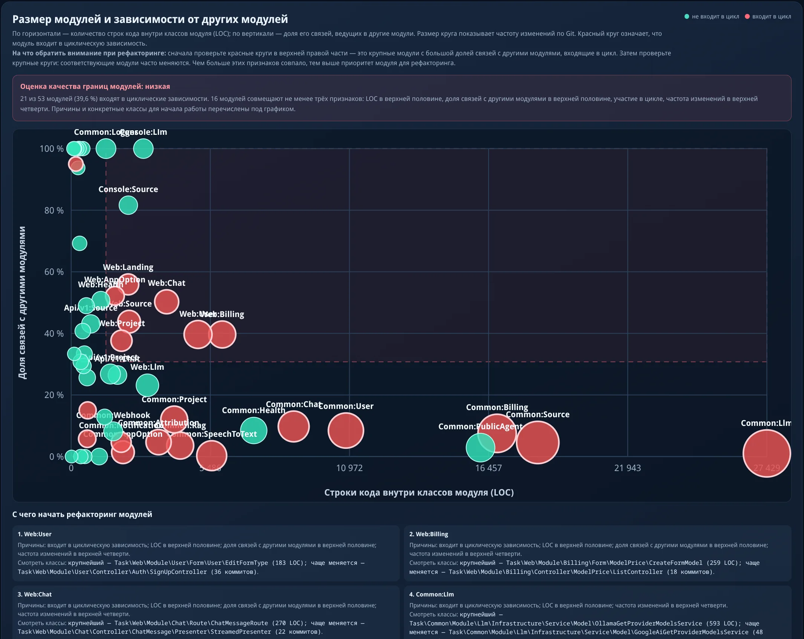
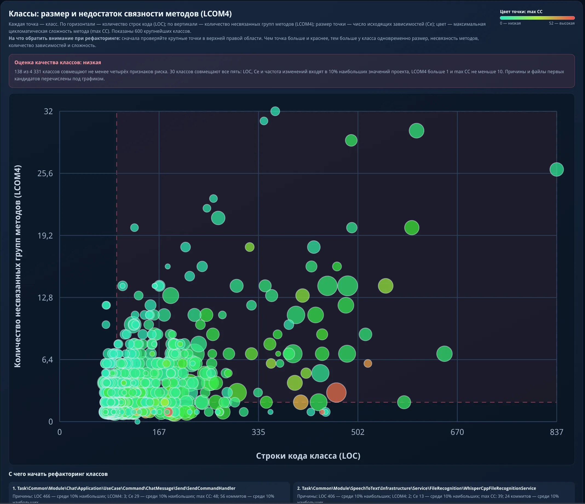
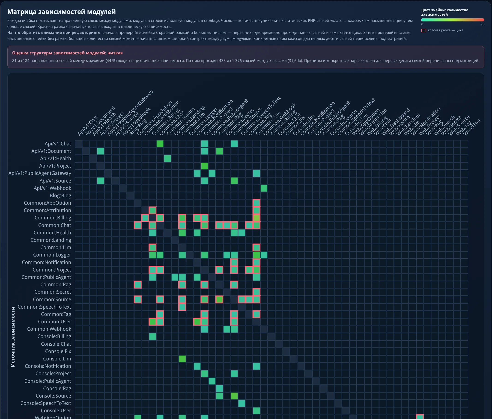

# Стандарт кодирования и обеспечения качества для PHP-проектов

Главная цель стандарта кодирования — поддержание высокой скорости разработки и удобной поддержки кода в долгосрочной перспективе. Скорость достигается за счёт единообразия: разработчик и AI-агент сразу знают, где лежит DTO, как устроен хендлер, какие зависимости допустимы между слоями. Поддержка — за счёт архитектурных подходов, зафиксированных в конвенциях: изоляция слоёв, чистые доменные модели, строгие границы модулей.

AI-агенты склонны отклоняться от конвенций. Поэтому соблюдение конвенций проверяется автоматически: сниффы PHP CodeSniffer и правила Deptrac ловят нарушения до кодревью. 

---

## Вектор развития

Проект объединяет конвенции, автоматические проверки и метрики качества. Цель —
давать разработчику и ИИ-агенту воспроизводимую обратную связь до кодревью.
Модель отчёта описана в [конвенции метрик качества](docs/conventions/ops/quality-metrics.md),
выбор инструментов — в [отчёте об исследовании](docs/research/metrics-tools-evaluation.md),
план развития — в [`EPIC-metrics-ai-maintainability`](todo/EPIC-metrics-ai-maintainability.todo.md).

### Сбор источников метрик

Для полного отчёта обязательны структурные метрики, граф Deptrac, размер
кодовой базы, статистика тестов и покрытие:

```bash
php bin/metrics-collect --source=src --output=var/metrics/collector.json
vendor/bin/deptrac analyse --formatter=metrics-json --output=var/metrics/deptrac.json
bin/metrics-scc
composer metrics-test-stats
composer coverage
```

Для `metrics-scc` требуется `scc`, для `coverage` — PCOV. Они устанавливаются
отдельно и не входят в `composer check`:

```bash
go install github.com/boyter/scc/v3@latest
pecl install pcov
```

### Агрегация метрик

Агрегатор объединяет подготовленные источники в `var/metrics/report.json`:

```bash
php bin/metrics-aggregate.php \
  --analyzer=var/metrics/collector.json \
  --deptrac=var/metrics/deptrac.json \
  --scc=var/metrics/scc.json \
  --tests=var/metrics/test-stats.json \
  --clover=var/metrics/clover.xml \
  --output=var/metrics/report.json
```

Отсутствие обязательного источника завершает команду ошибкой. `findings` в
итоговом отчёте остаются неблокирующими.

### Пример HTML-дашборда

Пример автономного HTML-дашборда на данных проекта TasK:
[`examples/task-metrics-dashboard.html`](examples/task-metrics-dashboard.html).

#### Размер модулей и зависимости от других модулей



#### Классы: размер и недостаток связности методов (LCOM4)



#### Матрица зависимостей модулей



### CLI-утилиты

Публичные команды пакета доступны через `vendor/bin/`. Внутренний
`metrics-aggregate.php` запускается из репозитория, как показано выше.

| Команда | Назначение |
|---|---|
| `coding-standard-init` | Копирует конвенции и конфигурации в проект |
| `validate-md-links` | Проверяет ссылки и якоря Markdown |
| `validate-language` | Проверяет англицизмы в русскоязычной документации |
| `metrics-collect` | Собирает структурные метрики PHP-кода |
| `metrics-scc` | Собирает размер кодовой базы и версию `scc` |
| `metrics-coverage` | Создаёт Clover-отчёт покрытия через PHPUnit и PCOV |
| `test-stats` | Считает файлы и строки по сьютам PHPUnit |
| `metrics-aggregate.php` | Формирует итоговый `report.json` |

---

## Конвенции

Документация описывает принципы, паттерны, слои, модули, тестирование и структуру Symfony-приложения. Служит справочником для команды и AI-агентов.

Полное содержание — в [индексе конвенций](docs/conventions/index.md).

---

## Автоматические проверки

Соблюдение конвенций проверяется через PHP CodeSniffer и Deptrac — без ручного кодревью структуры.

### Markdown-валидация

Проверка документации ведётся двумя инструментами:

- **`composer validate-docs`** — проверяет конвенции внутри каталога `docs/conventions/`: структуру front matter, именование файлов (kebab-case), обязательные секции и ссылки между документами каталога.
- **`composer validate-md-links`** — проверяет ссылки между Markdown-файлами всего проекта (пути и якоря). Область проверки настраивается через файл конфигурации `.md-links.php`. [Подробнее](docs/conventions/ops/validate-md-links.md).
- **`composer validate-language`** — ищет английские фразы в русскоязычном тексте Markdown/text-файлов (англицизмы вида «persisted rows»). Техническая терминология и code blocks исключаются. Настраивается через секцию `language` в `.coding-standard.php`. [Подробнее](docs/conventions/ops/validate-language.ru.md).


### PHP CodeSniffer-сниффы

| Снифф | Что проверяет |
|---|---|
| `DtoStructureSniff` | DTO — `final readonly`, только promoted-параметры в конструкторе, без методов и свойств |
| `EnumStructureSniff` | Enum — чистый (без методов, констант, трейтов), case'ы в `camelCase` |
| `ValueObjectStructureSniff` | Value Object — `final readonly`, неизменяемый, приватный конструктор, статические фабрики |
| `CommandQueryStructureSniff` | Command/Query — конструктор только с promoted-параметрами, без свойств и методов |
| `CommandHandlerStructureSniff` | `CommandHandler` — только `__invoke`, без публичных свойств |
| `QueryHandlerReturnTypeSniff` | `QueryHandler` — должен возвращать `Result` или `ResultDto` |
| `CommandHandlerReturnTypeSniff` | `CommandHandler` — должен возвращать `void` или `Result` |
| `UseCaseNamingSniff` | UseCase — обязательный суффикс; имя файла и неймспейс совпадают с путём |
| `GlobalFunctionCallStyleSniff` | Глобальные функции вызываются без обратного слеша и без `use function` |

### Deptrac-правила

| Правило | Что проверяет |
|---|---|
| `ServiceContractDependencyRule` | Infrastructure зависит только от Domain-интерфейсов, не от конкретных классов |
| `CrossModuleDomainRule` | Домен одного модуля не зависит от домена другого — только через Application DTO |

Готовый `depfile.yaml` с правилами для DDD-слоёв и модульных границ: [`config/deptrac/`](config/deptrac/). Копируется в проект через `coding-standard-init` или вручную.

### PHPStan-правила

Пользовательское PHPStan-расширение (Collector + Rule) для межфайловых проверок:

| Правило | Что проверяет |
|---|---|
| `DtoReuseRule` | Находит DTO в общей папке модуля (`Module\{ModuleName}\Application\Dto`), которые по факту использует только один use case, и предлагает переложить их рядом с владельцем. |
| `MessageContractDtoLocationRule` | Проверяет расположение DTO, используемых в контрактах Command и Query. |
| `ForbiddenInvokableHandlerCallRule` | Запрещает прямой вызов Command Handler и Query Handler как вызываемого объекта. |
| `ForbiddenExplicitHandlerInvokeRule` | Запрещает прямой вызов метода `__invoke()` у Command Handler и Query Handler. |

Потребитель добавляет `phpstan/phpstan` в `require-dev` и подключает правила пакета в конфигурации PHPStan:

```neon
includes:
    - vendor/prikotov/coding-standard/phpstan-rules.neon
```

Подробные варианты подключения описаны в разделе [«Подключение PHPStan»](#подключение-phpstan).

Конвенция размещения DTO: [`docs/conventions/core-patterns/dto.md`](docs/conventions/core-patterns/dto.md).

Примеры конфигураций: [`docs/conventions/examples/`](docs/conventions/examples/)

| Файл | Назначение |
|---|---|
| `phpcs.xml.dist` | PHP CodeSniffer |
| `phpunit.xml.dist` | PHPUnit |
| `phpmd.xml` | PHPMD |
| `phpstan.neon.dist` | PHPStan |
| `psalm.xml` | `Psalm` |
| `Makefile` | Команды проверки (`make check`) |

---

## Установка

```bash
composer require --dev prikotov/coding-standard
```

Скопируйте конвенции и конфигурации в проект:

```bash
php vendor/bin/coding-standard-init --project-name=ProjectName
```

В состав пакета входят:

- **Сниффы** — PHP CodeSniffer-правила, работают сразу из `vendor/`
- **Deptrac-правила** — пользовательские правила для deptrac
- **PHPStan-правила** — пользовательские правила для phpstan
- **Конфигурации** — `depfile.yaml` для Deptrac, `phpcs.xml.dist` для `PHPCS`, `phpstan.neon.dist` для PHPStan
- **Шаблоны исключений** — типовые классы и интерфейсы, копируются с подстановкой namespace проекта
- **Конвенции** — документация, копируется командой `coding-standard-init`

### Подключение `PHPCS`

```xml
<config name="installed_paths" value="vendor/prikotov/coding-standard"/>
<rule ref="PrikotovCodingStandard"/>
```

### Подключение PHPStan

Добавьте PHPStan в проект, если он ещё не установлен:

```bash
composer require --dev phpstan/phpstan
```

Рекомендуемый вариант — явно подключить правила пакета в `phpstan.neon` или `phpstan.neon.dist`:

```neon
includes:
    - vendor/prikotov/coding-standard/phpstan-rules.neon
```

Явное подключение не зависит от Composer-плагинов и гарантирует применение правил после обновления пакета.

Альтернативный вариант — автоматическое подключение через `phpstan/extension-installer`:

```bash
composer config allow-plugins.phpstan/extension-installer true
composer require --dev phpstan/extension-installer
```

При автоматическом подключении добавлять `phpstan-rules.neon` в `includes` не нужно. Без одного из этих двух вариантов
пользовательские PHPStan-правила пакета не выполняются.

### Копирование конвенций в проект

```bash
php vendor/bin/coding-standard-init
```

По умолчанию существующие файлы не перезаписываются. Флаг `--force` включает перезапись.

```bash
php vendor/bin/coding-standard-init /path/to/project --docs-path=docs/ddd --deptrac-path=config/depfile.yaml --force
```

### Копирование типовых исключений

Шаблоны исключений хранятся в `config/exceptions/` и копируются в проект с подстановкой имени namespace.

```bash
php vendor/bin/coding-standard-init --project-name=Task
```

Это создаст файлы в `src/Common/Exception/` с namespace `Task\Common\Exception`.

| Опция | Описание |
|---|---|
| `--project-name=Task` | Имя проекта для namespace (обязательно для исключений) |
| `--exceptions-path=src/Common/Exception` | Путь копирования (по умолчанию) |
| `--no-exceptions` | Пропустить копирование исключений |

Без `--project-name` исключения пропускаются, остальные файлы копируются как обычно.

---

## Обновление

Обновите пакет в пределах версии, разрешённой в `composer.json`:

```bash
composer update prikotov/coding-standard --with-dependencies
```

Для перехода на следующую минорную версию до `1.0` обновите ограничение явно. Например, `^0.26` не разрешает установку
`0.27`:

```bash
composer require --dev prikotov/coding-standard:^0.27 --with-all-dependencies
```

Обновите скопированные конвенции и обязательную конфигурацию пакета:

```bash
php vendor/bin/coding-standard-init --force
```

Флаг `--force` перезаписывает ранее скопированные конвенции и `.coding-standard.php`. Проверьте изменения через
`git diff` и верните проектные настройки, если они отличаются от стандартных. Конфигурации `depfile.yaml`,
`phpcs.xml.dist` и `phpstan.neon.dist`, уже существующие в проекте, init-команда не перезаписывает.

После обновления запустите проверки проекта, включая PHPStan:

```bash
vendor/bin/phpstan analyse
composer check
```

---

## Лицензия

[Лицензия `MIT`](LICENSE)
