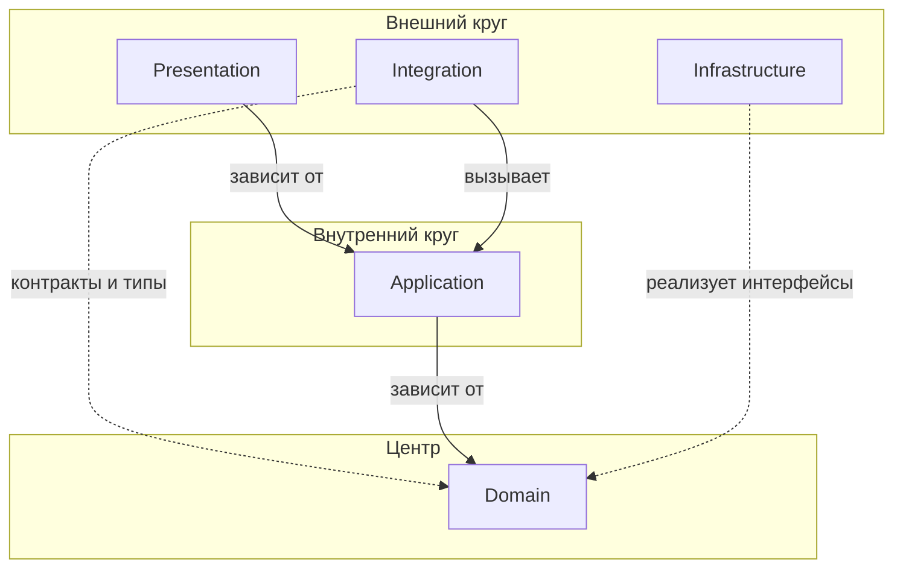

# Взаимодействие слоёв (Layer Interaction)

**Взаимодействие слоёв** — правила зависимостей между слоями архитектуры, основанные на принципах «чистой архитектуры» (Clean Architecture) — луковичной модели.

Подробнее: [«Чистая архитектура» Роберта Мартина (Clean Architecture by Robert C. Martin)](https://blog.cleancoder.com/uncle-bob/2012/08/13/the-clean-architecture.html)

## Общие правила

- Зависимости направлены **только внутрь**, к центру
- Внутренние слои не зависят от внешних
- Имена слоёв (`Domain`, `Application`, `Infrastructure`, `Integration`, `Presentation`) зарезервированы как сегменты пути: слой — это сегмент сразу после имени модуля; вложенных повторов имён слоёв в namespace быть не должно (например, `Domain\Service\Integration\...` запрещён)
- Внешние слои зависят от внутренних через контракты (`interface`) и согласованные типы ([DTO](../core-patterns/dto.md), [VO](../core-patterns/value-object.md), [Enum](../core-patterns/enum.md)) в рамках разрешённых правил
- DI-контейнер связывает интерфейсы с реализациями на уровне конфигурации

## Диаграмма зависимостей

## Описание слоёв

| Слой | Назначение | Зависимости |
|------|------------|-------------|
| **Domain** | Бизнес-логика, [Entity](domain/entity.md), [VO](../core-patterns/value-object.md), интерфейсы [Repository](domain/repository.md) | Нет |
| **Application** | Use Case, оркестрация, [DTO](../core-patterns/dto.md) | Domain |
| **Infrastructure** | Реализация репозиториев, кэш, персистентность, внешние API/SDK | Domain (контракты и типы) |
| **Integration** | События, middleware, межмодульное взаимодействие | Application, Domain (контракты и типы) |
| **Presentation** | Web, API, консоль, блог — точки входа | Application |

## Правила взаимодействия

### Domain → (никто)

Domain слой не зависит ни от кого:
- Нет зависимостей на Application, Infrastructure, Integration, Presentation
- Может использовать только стандартные типы PHP и свои интерфейсы

### Application → Domain

Application зависит только от Domain:
- Вызывает методы [Entity](domain/entity.md) и [VO](../core-patterns/value-object.md)
- Использует интерфейсы [Repository](domain/repository.md) из Domain
- Использует [Specification](domain/specification.md) и [Service](../core-patterns/service.md) из Domain
- Важно: [Application DTO](../core-patterns/dto.md) не должны зависеть от Domain и остаются только в рамках Application.

### Infrastructure → Domain

Infrastructure реализует интерфейсы Domain:
- Реализует доменный `RepositoryInterface` ([Repository](domain/repository.md))
- Может использовать доменные типы ([VO](../core-patterns/value-object.md), [Enum](../core-patterns/enum.md), [DTO](../core-patterns/dto.md)) в сигнатурах и маппинге
- Подключается через DI-контейнер
- Не используется напрямую из Application

### Integration → Application

Integration вызывает Application чужого модуля:
- Обрабатывает внешние события и инициирует соответствующие Use Case.
- Реализует интеграции через интерфейсы доменных [Service](../core-patterns/service.md).
- Может использовать доменные типы в сигнатурах контрактов ([VO](../core-patterns/value-object.md), [Enum](../core-patterns/enum.md), [DTO](../core-patterns/dto.md)).
- Не зависит от слоя Infrastructure.
- Адаптирует внешний контекст перед входом в Application.
- Не содержит HTTP/SDK-клиенты внешних API — такие клиенты размещаются в Infrastructure.

### Presentation → Application

Presentation зависит только от Application:
- Контроллеры передают Command/Query через CommandBus/QueryBus
- Не обращается к Domain, Infrastructure, Integration напрямую
- Валидация на уровне формы/DTO

## Матрица зависимостей

| Откуда ↓ / Куда → | Domain | Application | Infrastructure | Integration | Presentation |
|-------------------|--------|-------------|----------------|-------------|--------------|
| **Domain** | — | ❌ | ❌ | ❌ | ❌ |
| **Application** | ✅ | — | ❌ | ❌ | ❌ |
| **Infrastructure** | ✅ | ❌ | — | ❌ | ❌ |
| **Integration** | ✅* | ✅ | ❌ | — | ❌ |
| **Presentation** | ❌ | ✅ | ❌ | ❌ | — |

\* Только контракты и типы Domain (интерфейсы доменных [Service](../core-patterns/service.md), [VO](../core-patterns/value-object.md), [Enum](../core-patterns/enum.md), [DTO](../core-patterns/dto.md) в сигнатурах), без зависимости на доменные реализации.

## Расположение

Полный namespace включает префикс `{ProjectName}\` — корневой namespace проекта (например, `TaskOrchestrator\`).

- Domain: `{ProjectName}\Common\Module\{Module}\Domain\`
- Application: `{ProjectName}\Common\Module\{Module}\Application\`
- Infrastructure: `{ProjectName}\Common\Module\{Module}\Infrastructure\`
- Integration: `{ProjectName}\Common\Module\{Module}\Integration\`
- Presentation: `{ProjectName}\{App}\Module\{Module}\` (Web, Api, Console и др.)

Где:
- `{ProjectName}` — корневой namespace проекта (например, `TaskOrchestrator\`). Может быть пустым, если PSR-4 маппит `Common\` напрямую в `src/`.
- `{AppGroup}` (`Common`, `Web`, `Api`, `Console`, `Blog`) — группа: `Common` для разделяемого кода (`src/`), имя приложения — для кода конкретного приложения (`apps/<app>/`).

В примерах кода в документации префикс `ProjectName\` может быть опущен для краткости.

## Чек-лист для проведения ревью кода

- [ ] Зависимости между слоями соответствуют матрице.
- [ ] Domain не зависит от других слоёв.
- [ ] Application зависит только от Domain.
- [ ] Infrastructure реализует контракты Domain.
- [ ] Integration обращается к Domain (только контракты) и Application.
- [ ] Presentation обращается только к Application.
- [ ] Имена слоёв не используются как вложенные сегменты namespace другого слоя.
- [ ] Namespace следует паттерну `{ProjectName}\{AppGroup}\Module\...`.
