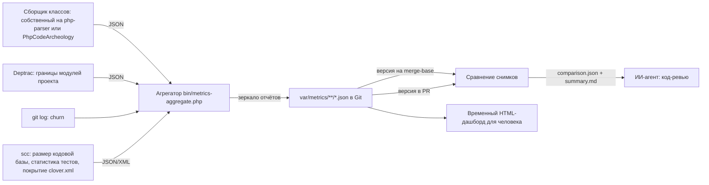

# EPIC-metrics-ai-maintainability: Метрики качества проекта для ИИ-агентов

## 0. Простое описание (Human Brief)

### Проблема простыми словами (Problem)

- ИИ-агенты и разработчики не имеют объективных числовых метрик качества проекта, подключившего `coding-standard`: связности (cohesion), связанности (coupling), размера и количества компонентов на уровнях «метод → класс» и «класс → модуль».
- Поддерживаемость оценивается субъективно (чтение кода, code review); нет данных для приоритизации рефакторинга и точки входа для агента в незнакомый код.
- Единого инструмента «модуль → классы → cohesion/coupling/размер → узкие места» нет; есть набор частичных анализаторов (PhpMetrics, PDepend, Deptrac, PhpCodeArcheology), которые нужно свести в единую модель и отчёт.
- Один снимок метрик показывает состояние проекта, но не даёт ИИ-агенту главного для код-ревью: объективного изменения качества между базовой веткой и текущими правками.
- JSON-структура из `var/metrics/` пока не является частью проекта: базовая ветка не хранит состояние метрик, а PR не содержит их обычный Git diff.

### Варианты или путь решения (Solution Sketch)

- Оценить кандидатов (PhpMetrics / PDepend / PhpCodeArcheology) на коде самого пакета и выбрать основу — TASK-metrics-tools-evaluation.
- Зафиксировать модель метрик (class-level и module-level, определение модуля, интерпретация) в docs/conventions/ — TASK-metrics-model-convention.
- Определить границы модулей пакета в конфиге Deptrac с JSON-выводом зависимостей — TASK-metrics-module-boundaries-deptrac.
- Собрать агрегатор: JSON анализатора + Deptrac + git churn → единый var/metrics/report.json — TASK-metrics-aggregator.
- Собрать метрику размера кодовой базы (scc), статистику тестов и покрытие — TASK-metrics-codebase-size.
- Связать цепочку в composer metrics и задокументировать получение снимка — TASK-metrics-composer-integration.
- Сделать каноническую зеркальную JSON-структуру `var/metrics/` частью Git и проверять её актуальность — TASK-metrics-tracked-snapshot.
- Реализовать детерминированное сравнение двух совместимых снимков и машиночитаемый отчёт об изменениях — TASK-metrics-report-diff.
- Включить сравнение «базовая ветка → текущие правки» в код-ревью ИИ-агента и артефакты PR — TASK-metrics-pr-review-workflow.
- Построить статический HTML-дашборд как дополнительное представление снимка для человека — TASK-metrics-html-dashboard.

### Ожидаемый результат (Expected Result)

- Каждая ревизия проекта хранит полную актуальную JSON-структуру `var/metrics/`; PR содержит обычный Git diff метрик вместе с diff кода.
- Детерминированное сравнение версий структуры на merge-base и в текущих правках фиксирует улучшения, ухудшения, добавленные и удалённые объекты.
- Изменение метрик входит в машиночитаемый артефакт PR и используется ИИ-агентом вместе с конвенциями и анализом кода при решении о прохождении код-ревью.
- `composer metrics` обновляет отслеживаемые JSON-отчёты и может построить неотслеживаемый автономный HTML-дашборд для просмотра человеком.
- Документация (docs/conventions/ + README + AGENTS.md) описывает модель, воспроизводимое сравнение, интерпретацию изменений и порядок код-ревью.

## 1. Concept and Goal (Концепция и Цель)

### Story (User Story)

> Как ИИ-агент, проводящий код-ревью, я хочу получать воспроизводимое изменение метрик между базовой веткой и текущими правками, чтобы видеть направление изменения качества и не принимать регрессию незаметно.

Инструментальный контур должен замыкать для ИИ-агента детерминированную обратную связь: одинаково измерять состояние до и после изменения, показывать нарушения и изменение метрик и позволять скорректировать решение до ручного кодревью.

### Goal (Цель по SMART)

Собрать в `prikotov/coding-standard` инструментальную цепочку для код-ревью подключаемого проекта: она создаёт полную детерминированную структуру `var/metrics/` на уровнях «метод → класс → модуль → проект» по зеркалу production-путей и требует хранить итоговые JSON в Git как часть состояния проекта. PR обновляет отчёты вместе с кодом, а сравнение версий структуры на merge-base и HEAD различает улучшения, ухудшения, добавленные и удалённые объекты. Raw diff остаётся в PR, производный отчёт входит в его артефакты и читается ИИ-агентом перед решением о прохождении ревью. HTML-дашборд остаётся дополнительным неотслеживаемым представлением для человека. Критерий: потребительский сценарий воспроизводится одной документированной цепочкой на TasK, одинаковые входы дают одинаковый результат, `composer check` пакета остаётся зелёным.

## 2. Context and Scope (Контекст и Границы)

- **Где делаем:** публичные CLI и классы этого пакета, шаблоны конфигурации, docs/conventions/, composer.json, README.md и AGENTS.md.
- **Что анализируем:** production-классы предметных модулей проекта-потребителя из Composer `autoload`; общий код и приложения различаются префиксами `Common`, `Web`, `Console`, `Api` и другими PSR-4-корнями. `packages/`, технические классы вне `Module/*` и `autoload-dev` не считаются модулями основного проекта.
- **Границы (Out of Scope):**
  - Не внедряем цепочку метрик в consumer-проекты автоматически (init-скрипт не трогаем).
  - Не меняем DDD-конвенции и автоматические проверки, не относящиеся к модели метрик.
  - Не строим серверный дашборд и не храним историю метрик в БД.
  - Не принимаем решение о всём код-ревью только по метрикам: ИИ-агент также проверяет код и конвенции.
  - Не считаем рост общего LOC или появление новых объектов автоматическим ухудшением.

## 3. Requirements (Требования, MoSCoW)

### 🔴 Must Have (Обязательно)

- [x] Выбор инструмента-основы по результатам прогона на этом пакете (TASK-metrics-tools-evaluation).
- [x] Модель метрик (class-level + module-level, определение модуля, интерпретация для агентов) в docs/conventions/ (TASK-metrics-model-convention).
- [x] Границы модулей проекта и JSON-вывод зависимостей через Deptrac (TASK-metrics-module-boundaries-deptrac).
- [x] Агрегатор: единый var/metrics/report.json по модели (TASK-metrics-aggregator).
- [ ] `composer metrics` + документация запуска и чтения отчёта (README, AGENTS.md) (TASK-metrics-composer-integration).
- [ ] Канонические JSON `var/metrics/` хранятся в Git и автоматически проверяются на актуальность (TASK-metrics-tracked-snapshot).
- [ ] Детерминированное сравнение совместимых снимков с машиночитаемым отчётом об изменениях (TASK-metrics-report-diff).
- [ ] Сценарий код-ревью ИИ-агентом: базовая ветка, текущие правки, артефакт PR и правило реакции на регрессию (TASK-metrics-pr-review-workflow).

### 🟡 Should Have (Желательно)

- [x] HTML-дашборд: bubble chart, scatter, treemap, матрица зависимостей (TASK-metrics-html-dashboard).
- [ ] Git churn как метрика класса и модуля (в TASK-metrics-aggregator).
- [x] Метрика размера кодовой базы (scc), статистика тестов и покрытие (TASK-metrics-codebase-size).

### 🟢 Could Have (Опционально)

- [ ] Долговременная история метрик между несколькими PR и релизами.
- [ ] Серверное хранилище отчётов.

### ⚫ Won't Have (Не будем делать)

- [ ] Не добавляем метрики в consumer-проекты автоматически (init-скрипт не трогаем).
- [ ] Не заменяем существующие проверки (phpcs, phpstan, deptrac) метриками.
- [ ] Не строим серверный дашборд и не храним историю в БД.
- [ ] Не используем единый универсальный балл и абсолютные пороги пакета для решения о прохождении ревью.

## 4. Solution Design (Техническое решение)

- Выбор анализатора — результат TASK-metrics-tools-evaluation.
- Схема report.json — из модели TASK-metrics-model-convention.
- Маппинг «класс → модуль» — из конфига Deptrac TASK-metrics-module-boundaries-deptrac.
- Каноническая структура совпадает с зеркалом из конвенции: корневой, каталоговые и файловые отчёты хранятся в Git без времени генерации, абсолютных путей и самоссылки на commit.
- HTML и промежуточные результаты анализаторов внутри `var/metrics/` остаются неотслеживаемыми.
- Дашборд строится из канонического снимка и не является отслеживаемым артефактом проекта.
- Сравниваются только снимки с совместимыми версиями схемы и определений метрик; несовместимость является отдельным результатом, а не нулевой дельтой.
- Сравнение остаётся детерминированным: одинаковые входные снимки и конфигурация дают байт-в-байт одинаковый результат без временных полей.
- ИИ-агент оценивает изменение метрик вместе с diff кода и конвенциями; необъяснённое ухудшение в изменённой области блокирует одобрение ревью.

## 5. Implementation Plan (План реализации)

- [x] [TASK-metrics-tools-evaluation](done/TASK-metrics-tools-evaluation.todo.md) — оценка анализаторов и выбор основы
- [x] [TASK-metrics-model-convention](done/TASK-metrics-model-convention.todo.md) — модель метрик в docs/conventions/
- [x] [TASK-metrics-module-boundaries-deptrac](done/TASK-metrics-module-boundaries-deptrac.todo.md) — полный граф зависимостей проекта через Deptrac
- [x] [TASK-metrics-aggregator](done/TASK-metrics-aggregator.todo.md) — агрегатор и report.json
- [x] [TASK-metrics-codebase-size](done/TASK-metrics-codebase-size.todo.md) — размер кодовой базы (scc), статистика тестов, покрытие
- [x] [TASK-metrics-html-dashboard](done/TASK-metrics-html-dashboard.todo.md) — статический HTML-дашборд
- [ ] [TASK-metrics-composer-integration](TASK-metrics-composer-integration.todo.md) — composer metrics и документация
- [ ] [TASK-metrics-tracked-snapshot](TASK-metrics-tracked-snapshot.todo.md) — актуальная зеркальная структура метрик в Git
- [ ] [TASK-metrics-report-diff](TASK-metrics-report-diff.todo.md) — детерминированное сравнение снимков метрик
- [ ] [TASK-metrics-pr-review-workflow](TASK-metrics-pr-review-workflow.todo.md) — использование изменения метрик ИИ-агентом и публикация артефакта PR

## 6. Definition of Done (Критерии приёмки эпика)

- [ ] Все Must-задачи выполнены: отслеживаемая структура отчётов покрывает модель метрик.
- [ ] `composer metrics` работает end-to-end одной командой в проекте-потребителе.
- [ ] Канонические JSON `var/metrics/` содержат все метрики, хранятся в Git и проверяются на соответствие текущим входам.
- [ ] Для одного PR воспроизводимо сравниваются версии структуры на merge-base и HEAD.
- [ ] Артефакт PR содержит исходные снимки, детерминированную дельту и краткое резюме для ИИ-агента.
- [ ] Инструкция код-ревью требует проверить изменение метрик и не одобрять необъяснённую регрессию в изменённой области.
- [x] HTML-дашборд отображает реальные данные проекта TasK.
- [ ] docs/conventions/, README, AGENTS.md обновлены; `composer check` зелёный.

## 7. Release Notes and Deployment (Инструкция по релизу)

- [ ] Публичная команда метрик и её зависимости поставляются пакетом через Packagist.
- [ ] Инструкция показывает script `metrics` в `composer.json` проекта-потребителя.
- [ ] Инструкция требует коммитить канонические JSON `var/metrics/` и проверять их актуальность в CI.
- [ ] Инструкция показывает извлечение baseline из Git, сравнение с current и сохранение артефакта PR.
- [ ] Инструкция разделяет отслеживаемые JSON и неотслеживаемые HTML/промежуточные файлы в `var/metrics/`.
- [ ] README содержит раздел «Метрики качества».

## 8. Risks and Dependencies (Риски и зависимости)

- Значения LCOM/Ca/Ce у разных инструментов расходятся — нужна сверка на знакомых классах (TASK-metrics-tools-evaluation).
- Поддержка PHP 8.4 (атрибуты, readonly-свойства) у PhpMetrics/PDepend может быть неполной — проверяется в TASK-metrics-tools-evaluation.
- Модуль ≠ пакет или технический namespace: маппинг «класс → модуль» строится по Composer `autoload`, namespace с сегментом `Module` и `metrics.module_patterns` проекта-потребителя.
- Churn требует истории git репозитория; на короткой истории значения малоинформативны.
- Churn в отслеживаемых отчётах должен одинаково учитывать подготовленные изменения до коммита и ту же ревизию после коммита.
- В крупном проекте зеркало создаёт много файлов; преимущество структуры — локальный diff рядом с путём изменённого исходника.
- scc и PCOV — обязательные внешние инструменты контура метрик, но не `composer check`; без размера кодовой базы и покрытия project-level отчёт считается неполным (TASK-metrics-codebase-size).
- Новые dev-зависимости — только публичные пакеты Packagist (в CI нет доступа к VCS-репозиториям).

## 9. Sources (Источники)

- [Обсуждение с ChatGPT: метрики качества проекта для ИИ-агентов](https://chatgpt.com/c/6a6c272c-a234-83eb-a421-5175608b5f2a)
- [PhpMetrics — метрики классов](https://github.com/phpmetrics/PhpMetrics)
- [PDepend — метрики PHP](https://pdepend.org)
- [Deptrac — документация](https://deptrac.github.io/deptrac/)
- [PhpCodeArcheology](https://github.com/PhpCodeArcheology/PhpCodeArcheology)
- `docs/conventions/index.md` — индекс конвенций (для модели метрик)
- `config/deptrac/depfile.yaml` — существующий шаблон Deptrac для consumer-проектов (не менять)

## 10. Comments (Комментарии)

- Гипотеза автора: метрики завязаны на Cohesion, Coupling, Размер и количество компонентов; «компонент» — пара класс-метод на нижнем уровне и модуль-класс на верхнем.
- Средний LCOM классов не является cohesion модуля; для модуля нужна отдельная графовая метрика (доля зависимостей внутри модуля, размер интерфейса наружу) — зафиксировано в TASK-metrics-model-convention.
- Для ИИ-агентов источник истины — отслеживаемая JSON-структура `var/metrics/`; HTML-дашборд — неотслеживаемое представление для людей.
- Главный результат код-ревью — не абсолютное значение отдельной метрики, а её изменение относительно базовой ветки при неизменных правилах измерения.
- Git уже хранит историю структуры: её версии на merge-base и HEAD являются входами сравнения, а артефакт PR содержит их детерминированную дельту.
- По результатам TASK-metrics-tools-evaluation PhpCodeArcheology 2.11.x выбран внешним эталоном. Узкий собственный сборщик на `nikic/php-parser` вместе с Deptrac предварительно предпочтительнее как конечная архитектура, но должен пройти прототипирование, сверку формул и нагрузочный прогон. Подробности: [сравнение PHP-анализаторов метрик](../docs/research/metrics-tools-evaluation.md).

## `Change History` (История изменений)

| Дата | Автор (роль) | Изменение |
| :--- | :--- | :--- |
| 2026-08-02 | pi (Pi Coding Agent) | Создание эпика по итогам обсуждения с ChatGPT о метриках качества проекта для ИИ-агентов. |
| 2026-08-02 | pi (Pi Coding Agent) | Добавлена задача TASK-metrics-codebase-size (размер кодовой базы через scc, статистика тестов, покрытие) по итогам обсуждения с пользователем; обновлены план, MoSCoW, схема пайплайна и риски. |
| 2026-08-06 | codex (Codex) | Зафиксирован выбор PhpCodeArcheology 2.11.x как инструмента-основы. |
| 2026-08-07 | codex (Codex) | Добавлена ссылка на постоянный отчёт об исследовании анализаторов метрик. |
| 2026-08-07 | codex (Codex) | По итогам расширенного поиска подтверждён основной анализатор; `scc` классифицирован как дополнительный источник размера проекта. |
| 2026-08-07 | codex (Codex) | Выбор подтверждён нагрузочным прогоном на 3 592 PHP-файлах; в исследование добавлено время работы инструментов. |
| 2026-08-07 | codex (Codex) | Добавлен вариант собственного сборщика; PhpCodeArcheology оставлен внешним эталоном до прототипа. |
| 2026-08-07 | codex (Codex) | Зафиксировано разделение сырых метрик, неблокирующих `findings` и пороговых диагностических инструментов. |
| 2026-08-07 | codex (Codex) | В README зафиксирован вектор развития от набора конвенций к детерминированной системе проверок и метрик. |
| 2026-08-07 | codex (Codex) | Цель инструментов уточнена как детерминированная обратная связь ИИ-агенту о качестве его решений. |
| 2026-08-09 | codex (Codex) | `scc` закреплён как обязательный источник размера кодовой базы; опциональным осталось покрытие, зависящее от PCOV. |
| 2026-08-09 | codex (Codex) | Покрытие закреплено как обязательная project-level метрика; окружение сбора метрик требует PCOV. |
| 2026-08-09 | codex (Codex) | TASK-metrics-codebase-size завершена и перенесена в архив. |
| 2026-08-10 | codex (Codex) | TASK-metrics-html-dashboard завершена и перенесена в архив. |
| 2026-08-10 | codex (Codex) | Финальная интеграция переориентирована с анализа самого `coding-standard` на анализ подключаемого проекта; проверочным проектом выбран TasK. |
| 2026-08-10 | codex (Codex) | Цель эпика переориентирована со снимка и HTML-дашборда на детерминированное сравнение метрик базовой ветки и текущих правок для код-ревью ИИ-агентом; добавлены задачи сравнения и PR-интеграции. |
| 2026-08-10 | codex (Codex) | Канонический снимок уточнён как отслеживаемая зеркальная структура `var/metrics/` из конвенции; единый lock-файл не используется. |
