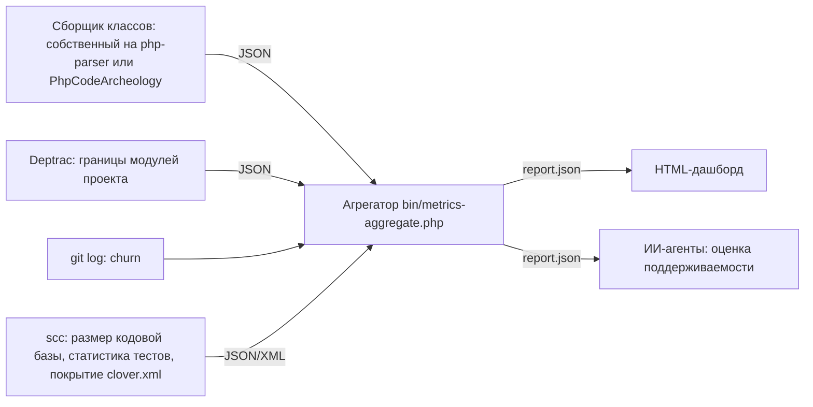

# EPIC-metrics-ai-maintainability: Метрики качества проекта для ИИ-агентов

## 0. Простое описание (Human Brief)

### Проблема простыми словами (Problem)

- ИИ-агенты и разработчики не имеют объективных числовых метрик качества проекта, подключившего `coding-standard`: связности (cohesion), связанности (coupling), размера и количества компонентов на уровнях «метод → класс» и «класс → модуль».
- Поддерживаемость оценивается субъективно (чтение кода, code review); нет данных для приоритизации рефакторинга и точки входа для агента в незнакомый код.
- Единого инструмента «модуль → классы → cohesion/coupling/размер → узкие места» нет; есть набор частичных анализаторов (PhpMetrics, PDepend, Deptrac, PhpCodeArcheology), которые нужно свести в единую модель и отчёт.

### Варианты или путь решения (Solution Sketch)

- Оценить кандидатов (PhpMetrics / PDepend / PhpCodeArcheology) на коде самого пакета и выбрать основу — TASK-metrics-tools-evaluation.
- Зафиксировать модель метрик (class-level и module-level, определение модуля, интерпретация) в docs/conventions/ — TASK-metrics-model-convention.
- Определить границы модулей пакета в конфиге Deptrac с JSON-выводом зависимостей — TASK-metrics-module-boundaries-deptrac.
- Собрать агрегатор: JSON анализатора + Deptrac + git churn → единый var/metrics/report.json — TASK-metrics-aggregator.
- Построить статический HTML-дашборд (bubble chart, scatter, treemap, матрица зависимостей) — TASK-metrics-html-dashboard.
- Собрать метрику размера кодовой базы (scc), статистику тестов и покрытие — TASK-metrics-codebase-size.
- Связать цепочку в composer metrics и задокументировать запуск и чтение отчёта — TASK-metrics-composer-integration.

### Ожидаемый результат (Expected Result)

- Команда `composer metrics` генерирует var/metrics/report.json со всеми метриками модели и статический HTML-дашборд.
- ИИ-агент по сырым метрикам и отдельному неблокирующему списку `findings` в `report.json` может оценить поддерживаемость подключаемого проекта: крупные несвязные классы, сложные методы, сильно связанные модули, циклы зависимостей и узкие места.
- Документация (docs/conventions/ + README + AGENTS.md) описывает модель метрик, команду запуска и интерпретацию чисел.

## 1. Concept and Goal (Концепция и Цель)

### Story (User Story)

> Как ИИ-агент и разработчик, я хочу получать объективные метрики качества проекта (cohesion, coupling, размер, количество компонентов) на уровнях «метод → класс» и «класс → модуль», чтобы оценивать поддерживаемость и находить узкие места без ручного чтения всего кода.

Инструментальный контур должен замыкать для ИИ-агента детерминированную обратную связь: одинаково измерять состояние до и после изменения, показывать нарушения и изменение метрик и позволять скорректировать решение до ручного кодревью.

### Goal (Цель по SMART)

Собрать в пакете `prikotov/coding-standard` инструментальную цепочку метрик качества подключаемого проекта: публичная команда `vendor/bin/coding-standard-metrics`, вызываемая его собственным script `composer metrics`, генерирует `var/metrics/report.json` (method-level: физический LOC и CC; class-level: размер, состав, WMC, LCOM4, Ca/Ce и модуль; module-level: распределение размера и сложности, связность, циклы и внешний интерфейс; project-level: размер кодовой базы, статистика тестов и покрытие) и статический HTML-дашборд. Модуль определяется как предметный компонент подключаемого проекта, а не как технический слой или пакет. Критерий: отчёт покрывает модель из docs/conventions/ops/quality-metrics.md, генерируется одной командой, `composer check` пакета остаётся зелёным.

## 2. Context and Scope (Контекст и Границы)

- **Где делаем:** публичные CLI и классы этого пакета, шаблоны конфигурации, docs/conventions/, composer.json, README.md и AGENTS.md.
- **Что анализируем:** production-классы предметных модулей проекта-потребителя из Composer `autoload`; общий код и приложения различаются префиксами `Common`, `Web`, `Console`, `Api` и другими PSR-4-корнями. `packages/`, технические классы вне `Module/*` и `autoload-dev` не считаются модулями основного проекта.
- **Границы (Out of Scope):**
  - Не внедряем цепочку метрик в consumer-проекты автоматически (init-скрипт не трогаем).
  - Не меняем существующие сниффы и конвенции.
  - Не строим CI-гейты по метрикам в этой итерации.
  - Не строим серверный дашборд и не храним историю метрик в БД.

## 3. Requirements (Требования, MoSCoW)

### 🔴 Must Have (Обязательно)

- [ ] Выбор инструмента-основы по результатам прогона на этом пакете (TASK-metrics-tools-evaluation).
- [ ] Модель метрик (class-level + module-level, определение модуля, интерпретация для агентов) в docs/conventions/ (TASK-metrics-model-convention).
- [ ] Границы модулей проекта и JSON-вывод зависимостей через Deptrac (TASK-metrics-module-boundaries-deptrac).
- [ ] Агрегатор: единый var/metrics/report.json по модели (TASK-metrics-aggregator).
- [ ] `composer metrics` + документация запуска и чтения отчёта (README, AGENTS.md) (TASK-metrics-composer-integration).

### 🟡 Should Have (Желательно)

- [x] HTML-дашборд: bubble chart, scatter, treemap, матрица зависимостей (TASK-metrics-html-dashboard).
- [ ] Git churn как метрика класса и модуля (в TASK-metrics-aggregator).
- [ ] Метрика размера кодовой базы (scc), статистика тестов и покрытие (TASK-metrics-codebase-size).

### 🟢 Could Have (Опционально)

- [ ] История метрик между версиями (сравнение отчётов).
- [ ] Пороговые проверки (например, в CI) на основе отчёта.

### ⚫ Won't Have (Не будем делать)

- [ ] Не гейтим CI метриками в этой итерации.
- [ ] Не добавляем метрики в consumer-проекты автоматически (init-скрипт не трогаем).
- [ ] Не заменяем существующие проверки (phpcs, phpstan, deptrac) метриками.
- [ ] Не строим серверный дашборд и не храним историю в БД.

## 4. Solution Design (Техническое решение)

- Выбор анализатора — результат TASK-metrics-tools-evaluation.
- Схема report.json — из модели TASK-metrics-model-convention.
- Маппинг «класс → модуль» — из конфига Deptrac TASK-metrics-module-boundaries-deptrac.
- Дашборд читает только report.json — зависит от схемы, не от инструментов.

## 5. Implementation Plan (План реализации)

- [x] [TASK-metrics-tools-evaluation](done/TASK-metrics-tools-evaluation.todo.md) — оценка анализаторов и выбор основы
- [x] [TASK-metrics-model-convention](done/TASK-metrics-model-convention.todo.md) — модель метрик в docs/conventions/
- [x] [TASK-metrics-module-boundaries-deptrac](done/TASK-metrics-module-boundaries-deptrac.todo.md) — полный граф зависимостей проекта через Deptrac
- [x] [TASK-metrics-aggregator](done/TASK-metrics-aggregator.todo.md) — агрегатор и report.json
- [x] [TASK-metrics-codebase-size](done/TASK-metrics-codebase-size.todo.md) — размер кодовой базы (scc), статистика тестов, покрытие
- [x] [TASK-metrics-html-dashboard](done/TASK-metrics-html-dashboard.todo.md) — статический HTML-дашборд
- [ ] [TASK-metrics-composer-integration](TASK-metrics-composer-integration.todo.md) — composer metrics и документация

## 6. Definition of Done (Критерии приёмки эпика)

- [ ] Все Must-задачи выполнены: report.json покрывает модель метрик.
- [ ] `composer metrics` работает end-to-end одной командой в проекте-потребителе.
- [x] HTML-дашборд отображает реальные данные проекта TasK.
- [ ] docs/conventions/, README, AGENTS.md обновлены; `composer check` зелёный.

## 7. Release Notes and Deployment (Инструкция по релизу)

- [ ] Публичная команда метрик и её зависимости поставляются пакетом через Packagist.
- [ ] Инструкция показывает script `metrics` в `composer.json` проекта-потребителя.
- [ ] Инструкция требует добавить `var/metrics/` в `.gitignore` проекта-потребителя.
- [ ] README содержит раздел «Метрики качества».

## 8. Risks and Dependencies (Риски и зависимости)

- Значения LCOM/Ca/Ce у разных инструментов расходятся — нужна сверка на знакомых классах (TASK-metrics-tools-evaluation).
- Поддержка PHP 8.4 (атрибуты, readonly-свойства) у PhpMetrics/PDepend может быть неполной — проверяется в TASK-metrics-tools-evaluation.
- Модуль ≠ пакет или технический namespace: маппинг «класс → модуль» строится по Composer `autoload`, namespace с сегментом `Module` и `metrics.module_patterns` проекта-потребителя.
- Churn требует истории git репозитория; на короткой истории значения малоинформативны.
- scc и PCOV — обязательные внешние инструменты контура метрик, но не `composer check`; без размера кодовой базы и покрытия project-level отчёт считается неполным (TASK-metrics-codebase-size).
- Новые dev-зависимости — только публичные пакеты Packagist (в CI нет доступа к VCS-репозиториям).

## 9. Sources (Источники)

- [Обсуждение с ChatGPT: метрики качества проекта для ИИ-агентов](https://chatgpt.com/c/6a6c272c-a234-83eb-a421-5175608b5f2a)
- [PhpMetrics — метрики классов](https://github.com/phpmetrics/PhpMetrics)
- [PDepend — метрики PHP](https://pdepend.org)
- [Deptrac — документация](https://deptrac.github.io/deptrac/)
- [PhpCodeArcheology](https://github.com/PhpCodeArcheology/PhpCodeArcheology)
- `docs/conventions/index.md` — индекс конвенций (для модели метрик)
- `config/deptrac/depfile.yaml` — существующий шаблон Deptrac для consumer-проектов (не менять)

## 10. Comments (Комментарии)

- Гипотеза автора: метрики завязаны на Cohesion, Coupling, Размер и количество компонентов; «компонент» — пара класс-метод на нижнем уровне и модуль-класс на верхнем.
- Средний LCOM классов не является cohesion модуля; для модуля нужна отдельная графовая метрика (доля зависимостей внутри модуля, размер интерфейса наружу) — зафиксировано в TASK-metrics-model-convention.
- Для ИИ-агентов главный артефакт — machine-readable report.json; HTML-дашборд — для людей.
- По результатам TASK-metrics-tools-evaluation PhpCodeArcheology 2.11.x выбран внешним эталоном. Узкий собственный сборщик на `nikic/php-parser` вместе с Deptrac предварительно предпочтительнее как конечная архитектура, но должен пройти прототипирование, сверку формул и нагрузочный прогон. Подробности: [сравнение PHP-анализаторов метрик](../docs/research/metrics-tools-evaluation.md).

## `Change History` (История изменений)

| Дата | Автор (роль) | Изменение |
| :--- | :--- | :--- |
| 2026-08-02 | pi (Pi Coding Agent) | Создание эпика по итогам обсуждения с ChatGPT о метриках качества проекта для ИИ-агентов. |
| 2026-08-02 | pi (Pi Coding Agent) | Добавлена задача TASK-metrics-codebase-size (размер кодовой базы через scc, статистика тестов, покрытие) по итогам обсуждения с пользователем; обновлены план, MoSCoW, схема пайплайна и риски. |
| 2026-08-06 | codex (Codex) | Зафиксирован выбор PhpCodeArcheology 2.11.x как инструмента-основы. |
| 2026-08-07 | codex (Codex) | Добавлена ссылка на постоянный отчёт об исследовании анализаторов метрик. |
| 2026-08-07 | codex (Codex) | По итогам расширенного поиска подтверждён основной анализатор; `scc` классифицирован как дополнительный источник размера проекта. |
| 2026-08-07 | codex (Codex) | Выбор подтверждён нагрузочным прогоном на 3 592 PHP-файлах; в исследование добавлено время работы инструментов. |
| 2026-08-07 | codex (Codex) | Добавлен вариант собственного сборщика; PhpCodeArcheology оставлен внешним эталоном до прототипа. |
| 2026-08-07 | codex (Codex) | Зафиксировано разделение сырых метрик, неблокирующих `findings` и пороговых диагностических инструментов. |
| 2026-08-07 | codex (Codex) | В README зафиксирован вектор развития от набора конвенций к детерминированной системе проверок и метрик. |
| 2026-08-07 | codex (Codex) | Цель инструментов уточнена как детерминированная обратная связь ИИ-агенту о качестве его решений. |
| 2026-08-09 | codex (Codex) | `scc` закреплён как обязательный источник размера кодовой базы; опциональным осталось покрытие, зависящее от PCOV. |
| 2026-08-09 | codex (Codex) | Покрытие закреплено как обязательная project-level метрика; окружение сбора метрик требует PCOV. |
| 2026-08-09 | codex (Codex) | TASK-metrics-codebase-size завершена и перенесена в архив. |
| 2026-08-10 | codex (Codex) | TASK-metrics-html-dashboard завершена и перенесена в архив. |
| 2026-08-10 | codex (Codex) | Финальная интеграция переориентирована с анализа самого `coding-standard` на анализ подключаемого проекта; проверочным проектом выбран TasK. |
